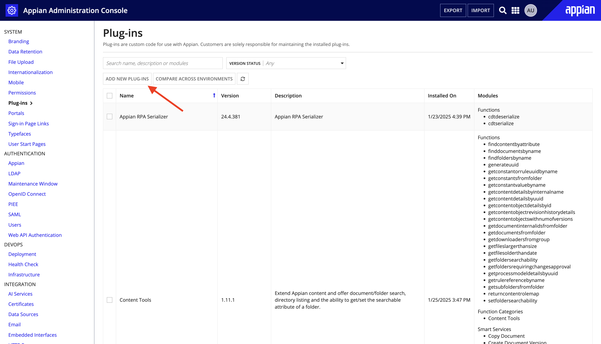

# OWL-Automation-Support
This app is to support few complex scenarios in owl automation

# Plugin Installation:
1.In the target environment, log in as the deployment user.
2.Navigate to the Admin Console.
3.On the left side of the console, click Plug-ins.
4.Click ADD NEW PLUG-INS.

5.Search for the plug-in by name - Content Tools.
6.Click on the plug-in name.
7.Click DEPLOY.

App Import and Changes in the Interface(s)
Download the App OWL Automation Support from here - Owl Automation Support.zip
Import the App to the site.
After successful import open the interface - OAS_OWL_dev_tool_sync_all_records_ui
Delete and re-enter the function name getconstantvaluebyname in lines 8 and 54.